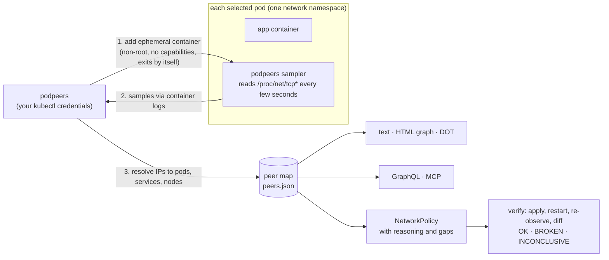

<div align="center">

# podpeers

**Write Kubernetes NetworkPolicy from traffic you actually observed, and prove it didn't break anything.**

No flow logs. No agents. No DaemonSet. Just your `kubectl` credentials.

[](https://github.com/terraboops/podpeers/actions/workflows/ci.yml)
[](go.mod)
[](LICENSE)


<sub>A real run on a local k3d cluster: <code>podpeers capture</code> → <code>podpeers serve</code> (web UI) → <code>podpeers suggest</code> → <code>kubectl apply</code>. The 10-second capture window is jump-cut.</sub>

</div>

---

Most clusters run with no NetworkPolicy, because nobody knows what talks to
what, and guessing wrong takes production down. The usual fix is a flow-log
pipeline: a particular CNI, Hubble, VPC flow logs, an agent on every node.
That's a lot of machinery for the question *"who does this pod talk to?"*

**podpeers answers it with the kernel's own socket table.** It adds a
short-lived ephemeral container to each pod you select. The container reads
`/proc/net/tcp*` (what `netstat` reads) for a few minutes and exits. podpeers
turns that into:

- 🗺️ **A peer map**: pods, services, nodes and external addresses, with
  direction, port, and whether each connection stayed open, closed, or never
  got through.
- 🛡️ **NetworkPolicy suggestions**: ready-to-`kubectl apply` YAML that allows
  exactly what was observed. Every rule says *why* it exists, and every
  policy says what it does **not** cover.
- ✅ **Verification**: apply a policy, re-observe, and get **OK / BROKEN /
  INCONCLUSIVE**, including breakage your `helm test` doesn't exercise.
- 🔎 **GraphQL**, an **interactive HTML graph**, **Graphviz**, an **MCP
  server** for agents, and a **Claude Code skill** that runs the whole loop.

## 60-second quickstart

```bash
go install github.com/terraboops/podpeers/cmd/podpeers@latest

# observe every pod labelled app.kubernetes.io/part-of=shop for 10 minutes
podpeers capture -n shop -l app.kubernetes.io/part-of=shop --duration 10m -o peers.json

podpeers render peers.json                         # what talks to what
podpeers suggest -n shop peers.json > policy.yaml  # NetworkPolicy, with reasoning
podpeers serve peers.json                          # web UI: graph + GraphQL on 127.0.0.1:8080
```

> [!IMPORTANT]
> On anything but a local kind/k3d cluster, `capture` **refuses to run** until
> you name the context explicitly: `--allow-context=<exact-context-name>`.
> That's deliberate. See [Safety](#safety-it-refuses-your-production-cluster).

## What you get

```text
$ podpeers render peers.json
pp-app/api  [observed]
  listening: tcp/9000
  DIR  PEER             KIND  PORT      CONNS  STATE
  <-   pp-app/brief     pod   tcp/9000  1      closed in window
  <-   pp-app/excluded  pod   tcp/9000  1      open
  <-   pp-app/web       pod   tcp/9000  1      open

pp-app/loner  [observed]
  no peers observed

pp-app/pending  [skipped: pod phase is Pending, not Running]
```

```yaml
$ podpeers suggest peers.json
# WHY each rule exists:
#   egress[0] allows pods behind service pp-helm/shop-api (…component=api…) on tcp/api
#       shop-web-… -> svc/pp-helm/shop-api tcp/80: 6 connection(s), seen in 26 sample(s),
#       open at window end (service port 80 -> target port api)
#   egress[1] allows cluster DNS (pods k8s-app=kube-dns in kube-system) on udp/53, tcp/53
#       ASSUMED, not observed: DNS lookups are short UDP exchanges that socket sampling
#       rarely catches, and the observed outbound connections used names
#
# NOT COVERED by this observation:
#   - Egress is now limited to the rules above. The workload would LOSE: any service or
#     pod not listed under egress (dependencies that were idle during the window); every
#     address outside the cluster; the Kubernetes API server (if this workload uses its
#     service account) …
apiVersion: networking.k8s.io/v1
kind: NetworkPolicy
…
```

Both outputs are real, from the end-to-end suite.

And `podpeers serve` gives you the same capture as an interactive graph. By
default it shows **workloads**: replicas are folded together, and Services
are folded into the workloads behind them, with edges labelled by the real
target port. Switch to **Pods** for pod-level detail. Click anything to see
who connects to it and where it connects. A GraphQL console sits underneath.
`podpeers render -format html` writes the same page as one self-contained
file.


## How it works



- **Direction** comes from the pod's own listening sockets: a connection to a
  port it listens on is inbound.
- **Services**: the client sees the ClusterIP. podpeers maps it back to the
  Service, and in policies to the Service's selector and *target port*
  (named ports included), because policy is evaluated after DNAT.
- **"Never got through"** is tracked per connection. A connect that only ever
  reaches `SYN_SENT`, or `CLOSE` after a REJECT, is the fingerprint of a
  policy drop. `TIME_WAIT` leftovers from before the window can't mask it.
- **Workloads**: owner references group replicas (`Deployment/web`), so
  policies and before/after diffs survive pod restarts.

## Safety: it refuses your production cluster

podpeers modifies every pod a selector matches. Pointing it at the wrong
context would be an incident, so **refusal is the default**, enforced by two
gates before any pod is touched:

1. **Pre-flight, from the kubeconfig alone, with zero network traffic.** The
   context name must be one a local tool writes (`kind-*`, `k3d-*`,
   `minikube`, `docker-desktop`, …) **and** the API server must be on
   loopback.
2. **After connecting, read-only.** Every node must be a kind/k3s node. This
   catches a `localhost` port-forward or tunnel to a cloud cluster.

The only way past is `--allow-context=<that exact context name>`. A
mismatched name is a refusal, not a fallback. Captures also *require* a label
selector, so there is no accidental "probe everything".

These aren't README promises. Tests prove a refusal makes **0 API requests**,
and the e2e suite proves on a real cluster that a refused run modifies **no
pods**.

The sampler runs as `nobody` with every capability dropped, a read-only root
filesystem and the RuntimeDefault seccomp profile, so it's admitted under the
`restricted` Pod Security Standard. It exits at the end of the window even if
you Ctrl-C podpeers.

## Verify a policy (and catch the ones that look fine)

```bash
podpeers diff before.json after.json   # exit 0 OK · 4 BROKEN · 5 INCONCLUSIVE
```

| line | meaning |
|---|---|
| `blocked` | worked before; after, connections never complete a handshake. **The policy dropped it.** |
| `lost` | seen before, gone after, while its observer was still observed |
| `preexisting` | only seen on connections opened *before* the policy, which the CNI never re-checks. **Proves nothing.** |
| `new` | not seen before |
| `glimpsed` | absent after, but before it was one short connection in one sample (a DNS lookup): sampling noise, not breakage |

**INCONCLUSIVE** exists because of something we hit for real while building
this: a policy that blocked every new connection verified "OK", because the
app's one long-lived connection predated the policy, and CNIs don't
re-evaluate established connections. So the workflow restarts workloads after
applying a policy, and podpeers refuses to call a flow verified unless it was
exercised under the policy.

## For agents: MCP server + Claude Code skill

```bash
claude mcp add podpeers -- podpeers mcp /abs/path/peers.json
```

The MCP server offers six tools: `summary`, `list_pods`, `peers`, `query`
(GraphQL), `suggest_policies`, and `diff_captures`. It is **read-only by
design, with no capture tool**. An agent can reason about traffic, but it
can't launch containers into your cluster through a tool call.

[`skills/podpeers-netpol`](skills/podpeers-netpol/SKILL.md) is a Claude Code
skill (this repo is also a plugin) for the use case this was built for: **add
policy to a Helm release and prove the app still works.**

```
baseline (observe while `helm test` runs) → suggest → review the gaps with you
  → apply → restart → `helm test` + re-observe + diff → OK / BROKEN (why) / INCONCLUSIVE → fix or roll back
```

Hard-won lessons it teaches:

- **Run `helm test` inside the baseline window.** The test pod is a client
  too, and if it isn't observed, the policy correctly blocks it.
- **New pods race the CNI.** Allow-lists for a brand-new pod are programmed
  asynchronously. A test pod that connects in its first second can be dropped
  by a *correct* policy (on k3s it hangs after the handshake). Tests should
  retry with a bounded `timeout`, and you should re-run once before blaming
  the policy.
- **`helm test` passing isn't enough.** The demo's broken policy passes `helm
  test` and is caught only by the traffic diff.

## Query it

```bash
podpeers query peers.json '{ pod(id: "shop/api-0") { peers(direction: "inbound", open: true) { id kind } } }'
```

**Why GraphQL and not TinkerPop/Gremlin?** A capture is a small, typed,
read-only graph loaded from one file. GraphQL runs in-process with nothing to
operate; Gremlin needs a JVM server and a graph store. GraphQL's nested
selections (`pod → edges → peer → pod → seenBy`) cover the one- and two-hop
questions NetworkPolicy asks. What we give up is arbitrary-depth path search,
which per-hop policy doesn't need. `Pod.seenBy` gives the edges observed on
*other* pods that point at this one, which is the only evidence about pods you
didn't probe.

## How is this different from…

| | needs installed in-cluster | sees | suggests policy | verifies policy |
|---|---|---|---|---|
| CNI flow logs (Hubble, Calico, VPC logs) | specific CNI / agent / cloud | every packet flow | some (often commercial) | no |
| eBPF tracers (e.g. Inspektor Gadget) | DaemonSet with privileges | every connection event | yes | no |
| `kubectl debug` + `netstat` by hand | nothing | one pod, one moment | no | no |
| **podpeers** | **nothing** | sampled sockets of selected pods | **yes, with reasoning + gaps** | **yes (OK / BROKEN / INCONCLUSIVE)** |

podpeers trades completeness for zero footprint. If you already run Hubble,
use it for observation; podpeers' suggest/verify loop still applies.

## FAQ

**Isn't sampling going to miss things?** Yes, and podpeers says so in every
suggestion. A connection that opens and closes between two samples is
invisible, although the closing side's 60-second `TIME_WAIT` often catches
short HTTP calls. Use a short `--interval`, a long `--duration`, and run your
rarest operations inside the window. Where evidence is thin, `suggest`
**refuses** rather than guesses: no pod observed, too few samples, no stable
labels, hostNetwork pods, or no traffic at all.

**Does it leave anything behind?** The sampler exits by itself. But
Kubernetes has no API to delete an ephemeral container, so a terminated
`podpeers-<run>` entry stays in each probed pod's status until the pod is
replaced.

**Why not eBPF?** eBPF sees everything, but needs privileges and an agent on
every node, which is the footprint this tool exists to avoid.

**Does it see process names (`netstat -p`)?** No. That would need root and
process-namespace sharing in the debug container. Sockets are enough to write
policy.

## Testing

```bash
make test   # unit tests, race detector
make e2e    # spins up a throwaway single-node k3d cluster and runs the real-cluster suite
```

The end-to-end suite runs the real binary against **real pods with known
connections** and asserts the output matches **exactly**. It never reads your
kubeconfig, and refuses to run unless the context is the cluster it created.
Named cases:

| case | asserted on a real cluster |
|---|---|
| known peers, incl. cross-namespace via Services | exact edge sets, both ends |
| pod with no peers | observed, zero edges, `suggest` refuses it |
| connection closed mid-window | `closed` on both ends |
| pod outside the selector | never touched, still resolved as a peer |
| pending pod | skipped, never touched |
| debug container can't start | fails fast with `ErrImagePull`, exit 3 |
| namespace you may read but not modify | per-pod `forbidden` naming the missing permission |
| namespace you may not read | clean failure, exit 1 |
| namespace enforcing Pod Security `restricted` | enforcement proven on (a plain pod is rejected); podpeers' debug container is admitted and observes the known flow |
| non-local context name for a reachable cluster | refused, exit 2, nothing modified |
| suggestions from real traffic | API server accepts every policy (dry run) |
| connection older than a policy | INCONCLUSIVE, while new connects are blocked |
| MCP over stdio | answers from the real capture |
| Helm skill workflow | good policy OK; intruder blocked; break invisible to `helm test` caught by diff; break visible to `helm test` caught and rolled back |

CI runs both suites on every push. The e2e suite runs on a k3d cluster on the
runner.

**The tests have teeth, and that's checked too.** Each named negative case,
the safety guard, the skill script's own context refusal, and admission under
Pod Security `restricted` has a mutant in [`hack/mutants/`](hack/mutants): a
one-line patch that breaks exactly that protection. `make mutants-e2e` applies
each one in a scratch worktree and requires the unit **and** real-cluster tests
to fail **for the expected reason**; it also checks that they pass unmutated.
CI runs it on every push. Writing the mutants found one test that caught a bug
only by accident (ignoring the label selector injected into `kube-system`
pods). That test now checks the cluster-wide invariant directly: no pod
outside the selector is touched.

## Limits, honestly

- Sampling, not packet capture (see FAQ).
- hostNetwork pods are skipped: their sockets are the node's.
- Peers in namespaces you can't list resolve as plain addresses.
- Assumes little-endian nodes (amd64/arm64).
- Enforcement details (kubelet probes, new-pod timing, REJECT vs DROP) vary by
  CNI. Verify on the CNI you run.

## Contributing

Issues and PRs welcome. Read [`CLAUDE.md`](CLAUDE.md) first: it's the contract
for humans and agents alike. In short: never point anything at a non-local
cluster, keep the guard's default at refusal, keep MCP read-only, and keep
real environments out of this public repo (`hack/hygiene.sh` checks).

Re-record the demo with `docs/demo/make-demo.sh` (vhs for the terminal,
Firefox via Selenium for the web UI) against `make e2e-cluster`. Diagrams are
checked with `make docs`.

## License

[MIT](LICENSE)
