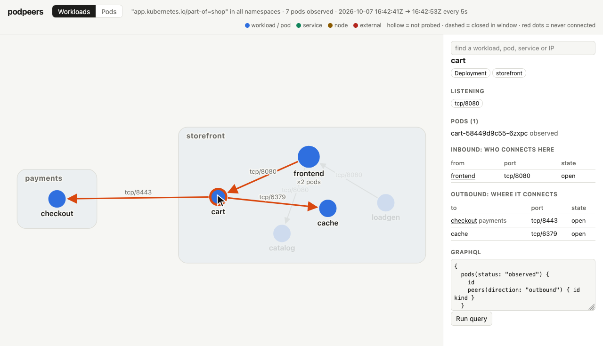
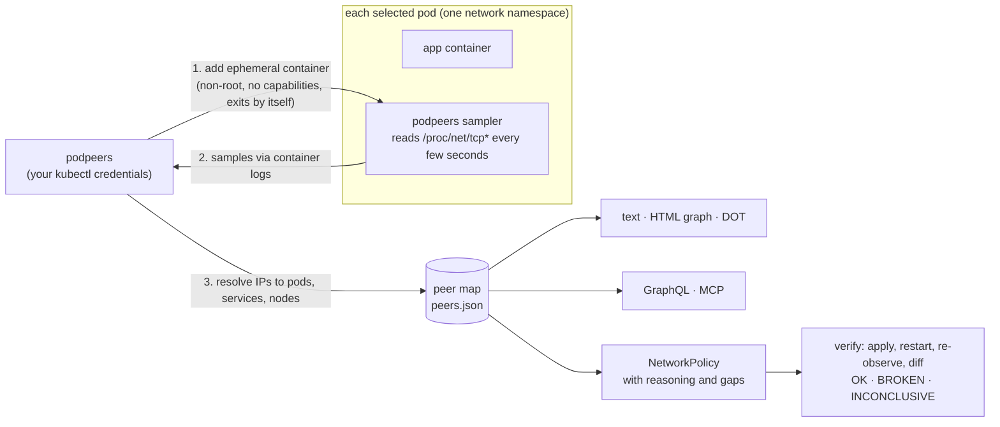

<div align="center">

# podpeers

**Write Kubernetes NetworkPolicy from traffic you actually observed, and prove it didn't break anything.**

No flow logs. No agents. No DaemonSet. Just your `kubectl` credentials.

[](https://github.com/terraboops/podpeers/actions/workflows/ci.yml)
[](go.mod)
[](LICENSE)


<sub>A real run on a local k3d cluster: <code>podpeers capture</code> → <code>podpeers serve</code> (web UI) → <code>podpeers suggest</code> → <code>kubectl apply</code>. The 10-second capture window is jump-cut.</sub>

</div>

---

Most clusters run with no NetworkPolicy, because nobody knows what talks to
what, and guessing wrong takes production down. The usual fix is a flow-log
pipeline: a particular CNI, Hubble, VPC flow logs, an agent on every node.
That's a lot of machinery for the question *"who does this pod talk to?"*

**podpeers answers it with the kernel's own socket table.** It adds a
short-lived ephemeral container to each pod you select. The container reads
`/proc/net/tcp*` (what `netstat` reads) for a few minutes and exits. podpeers
turns that into:

- 🗺️ **A peer map**: pods, services, nodes and external addresses, with
  direction, port, and whether each connection stayed open, closed, or never
  got through.
- 🛡️ **NetworkPolicy suggestions**: ready-to-`kubectl apply` YAML that allows
  exactly what was observed. Every rule says *why* it exists, and every
  policy says what it does **not** cover. That includes an `ENTRY POINT
  WARNING` when a port's only observed clients were test pods or Jobs, which
  means the real clients were never seen.
- ✅ **Verification**: apply a policy, re-observe, and get **OK / BROKEN /
  INCONCLUSIVE**, including breakage your `helm test` doesn't exercise.
- 🔎 **GraphQL**, an **interactive HTML graph**, **Graphviz**, an **MCP
  server** for agents, and a **Claude Code skill** that runs the whole loop.

## 60-second quickstart

```bash
go install github.com/terraboops/podpeers/cmd/podpeers@latest

# observe every pod labelled app.kubernetes.io/part-of=shop for 10 minutes
podpeers capture -n shop -l app.kubernetes.io/part-of=shop --duration 10m -o peers.json

podpeers render peers.json                         # what talks to what
podpeers suggest -n shop peers.json > policy.yaml  # NetworkPolicy, with reasoning
podpeers serve peers.json                          # web UI: graph + GraphQL on 127.0.0.1:8080
```

> [!IMPORTANT]
> On anything but a local kind/k3d cluster, `capture` **refuses to run** until
> you name the context explicitly: `--allow-context=<exact-context-name>`.
> That's deliberate. See [Safety](#safety-it-refuses-your-production-cluster).

## What you get

```text
$ podpeers render peers.json
pp-app/api  [observed]
  listening: tcp/9000
  DIR  PEER             KIND  PORT      CONNS  STATE
  <-   pp-app/brief     pod   tcp/9000  1      closed in window
  <-   pp-app/excluded  pod   tcp/9000  1      open
  <-   pp-app/web       pod   tcp/9000  1      open

pp-app/loner  [observed]
  no peers observed

pp-app/pending  [skipped: pod phase is Pending, not Running]
```

```yaml
$ podpeers suggest peers.json
# WHY each rule exists:
#   egress[0] allows pods behind service pp-helm/shop-api (…component=api…) on tcp/api
#       shop-web-… -> svc/pp-helm/shop-api tcp/80: 6 connection(s), seen in 26 sample(s),
#       open at window end (service port 80 -> target port api)
#   egress[1] allows cluster DNS (pods k8s-app=kube-dns in kube-system) on udp/53, tcp/53
#       ASSUMED, not observed: DNS lookups are short UDP exchanges that socket sampling
#       rarely catches, and the observed outbound connections used names
#
# NOT COVERED by this observation:
#   - Egress is now limited to the rules above. The workload would LOSE: any service or
#     pod not listed under egress (dependencies that were idle during the window); every
#     address outside the cluster; the Kubernetes API server (if this workload uses its
#     service account) …
apiVersion: networking.k8s.io/v1
kind: NetworkPolicy
…
```

Both outputs are real, from the end-to-end suite.

And `podpeers serve` gives you the same capture as an interactive graph. By
default it shows **workloads**: replicas are folded together, and Services
are folded into the workloads behind them, with edges labelled by the real
target port. Switch to **Pods** for pod-level detail. Click anything to see
who connects to it and where it connects. A GraphQL console sits underneath.
`podpeers render -format html` writes the same page as one self-contained
file.



## How it works



- **Direction** comes from the pod's own listening sockets: a connection to a
  port it listens on is inbound.
- **Services**: the client sees the ClusterIP. podpeers maps it back to the
  Service, and in policies to the Service's selector and *target port*
  (named ports included), because policy is evaluated after DNAT.
- **"Never got through"** is tracked per connection. A connect that only ever
  reaches `SYN_SENT`, or `CLOSE` after a REJECT, is the fingerprint of a
  policy drop. `TIME_WAIT` leftovers from before the window can't mask it.
- **Workloads**: owner references group replicas (`Deployment/web`), so
  policies and before/after diffs survive pod restarts.

## Safety: it refuses your production cluster

podpeers modifies every pod a selector matches. Pointing it at the wrong
context would be an incident, so **refusal is the default**, enforced by two
gates before any pod is touched:

1. **Pre-flight, from the kubeconfig alone, with zero network traffic.** The
   context name must be one a local tool writes (`kind-*`, `k3d-*`,
   `minikube`, `docker-desktop`, …) **and** the API server must be on
   loopback, reached directly rather than through a `proxy-url`.
2. **After connecting, read-only.** Every node must be a node of the cluster
   the context names: a `k3d-NAME` context only `k3d-NAME-server-N` /
   `k3d-NAME-agent-N` nodes, a `kind-NAME` context only `NAME-control-plane` /
   `NAME-worker` nodes. This catches a `localhost` port-forward or tunnel to a
   cloud cluster, and to another k3s or kind cluster: every k3s cluster,
   remote and production ones included, reports `k3s://` nodes, so the scheme
   alone proves nothing.

   The exact-name tools are held to their own node too: `colima` only to
   `k3s://colima`, `rancher-desktop` to `k3s://lima-rancher-desktop`,
   `orbstack` to `k3s://orbstack`, `docker-desktop` to its kind nodes
   (`desktop-control-plane`, …). podpeers knows no k3s or kind identity for
   minikube, so nothing passes as minikube.

   How sure those identities are, entry by entry:

   | context | node identity accepted | evidence |
   |---|---|---|
   | `k3d-NAME` | `k3s://k3d-NAME-server-N`, `-agent-N` | observed: the e2e cluster, every run |
   | `kind-NAME` | `kind://<runtime>/NAME/NAME-control-plane`, `-worker…` | observed once on a throwaway kind cluster (kind 0.31) |
   | `colima` | `k3s://colima` | observed once (colima 0.10.3, run with its own HOME and KUBECONFIG; `check-context` allowed it) |
   | `rancher-desktop`, `orbstack`, `docker-desktop` | as above | **asserted** that the tools report these, from each tool's documented default: not installed here, and installing them switches the default kubeconfig's context. What the gate does with each string *is* observed: the e2e suite forges each identity on a throwaway k3s node and requires it to be allowed under its own tool's name and refused under every other local name |
   | `minikube` | none | refuses every node |

   If an asserted entry is wrong, assume this: the gate accepts, under that
   context name, exactly a node reporting that ID and nothing else. If the
   tool really reports something else, a genuine local cluster is refused
   (`--allow-context` opts in). It never widens what is accepted. The only
   thing an entry can let through is a cluster reporting that exact ID,
   which is the same-identity residual below.

   **What still gets through, plainly:** a remote cluster whose nodes carry
   *exactly* the identity your context names, reached through a loopback
   port: a remote k3d or kind cluster with the same name (kind's default
   `kind`, context `kind-kind`, is the likely one), or a remote colima or
   Rancher Desktop VM with its default node name. Assume podpeers treats such
   a cluster as local and will modify its pods. The e2e suite pins this from
   two sides: a real TCP tunnel to the test cluster under its own context name
   is allowed, and so is a genuinely different cluster (a KWOK cluster with its
   own API server and CA) whose one node is named like the test cluster's,
   while the same clusters under any other identity are refused.

   Why it cannot be closed from here: everything the Kubernetes API offers
   that could tell two clusters apart is either a name (node names and
   provider IDs, derived from the cluster name), or comes with the very
   kubeconfig entry that points at the remote cluster (its CA and
   credentials), or cannot be compared with anything on this machine (a
   node's boot or machine ID lives inside the container VM on macOS, which
   podpeers cannot see). Proving that the API server runs on this machine
   would need the container runtime or the VM, and podpeers deliberately
   talks to nothing but the Kubernetes API. So: never give a tunnel to a
   remote cluster a local tool's context name, and if you must, use a name
   podpeers does not trust (it will then refuse unless you pass
   `--allow-context`).

The only way past is `--allow-context=<that exact context name>`. A
mismatched name is a refusal, not a fallback. Captures also *require* a label
selector, so there is no accidental "probe everything".

These aren't README promises. Tests prove a refusal makes **0 API requests**,
and the e2e suite proves on a real cluster that a refused run modifies **no
pods**.

The sampler runs as `nobody` with every capability dropped, a read-only root
filesystem and the RuntimeDefault seccomp profile, so it's admitted under the
`restricted` Pod Security Standard. It exits at the end of the window even if
you Ctrl-C podpeers.

## Verify a policy (and catch the ones that look fine)

```bash
podpeers diff before.json after.json   # exit 0 OK · 4 BROKEN · 5 INCONCLUSIVE
```

| line | meaning |
|---|---|
| `blocked` | worked before; after, connections opened under the policy never complete a handshake. **The policy dropped it.** |
| `lost` | seen before, gone after, while its observer was still observed |
| `preexisting` | only seen on connections opened *before* the policy, which the CNI never re-checks. **Proves nothing**, so the verdict is INCONCLUSIVE |
| `unverifiable` | the pod that saw it was not observed the second time. **Proves nothing**, so the verdict is INCONCLUSIVE |
| `new` | not seen before |
| `glimpsed` | absent after, but seen so rarely before that missing it in every sample after is likely by chance (more than 1%; a DNS lookup seen in 2 of 31 samples goes unseen in 31 more 13% of the time); the line states the odds. Sampling noise, not breakage |

**INCONCLUSIVE** exists because of something we hit for real while building
this: a policy that blocked every new connection verified "OK", because the
app's one long-lived connection predated the policy, and CNIs don't
re-evaluate established connections. So the workflow restarts workloads after
applying a policy, and podpeers refuses to call a flow verified unless a
connection opened under the policy completed. If the old connection is still
up but every new one fails, that is `blocked`, not OK.

## For agents: MCP server + Claude Code skill

```bash
claude mcp add podpeers -- podpeers mcp /abs/path/peers.json
```

The MCP server offers six tools: `summary`, `list_pods`, `peers`, `query`
(GraphQL), `suggest_policies`, and `diff_captures`. It is **read-only by
design, with no capture tool**. An agent can reason about traffic, but it
can't launch containers into your cluster through a tool call.

[`skills/podpeers-netpol`](skills/podpeers-netpol/SKILL.md) is a Claude Code
skill (this repo is also a plugin) for the use case this was built for: **add
policy to a Helm release and prove the app still works.**

```
baseline (observe while `helm test` runs) → suggest → review the gaps with you
  → apply → restart → `helm test` + re-observe + diff → OK / BROKEN (why) / INCONCLUSIVE → fix or roll back
```

Hard-won lessons it teaches:

- **Run `helm test` inside the baseline window.** The test pod is a client
  too, and if it isn't observed, the policy correctly blocks it.
- **New pods race the CNI.** Allow-lists for a brand-new pod are programmed
  asynchronously. A test pod that connects in its first second can be dropped
  by a *correct* policy (on k3s it hangs after the handshake). Tests should
  retry with a bounded `timeout`, and you should re-run once before blaming
  the policy.
- **`helm test` passing isn't enough.** The demo's broken policy passes `helm
  test` and is caught only by the traffic diff.

## Query it

```bash
podpeers query peers.json '{ pod(id: "shop/api-0") { peers(direction: "inbound", open: true) { id kind } } }'
```

**Why GraphQL and not TinkerPop/Gremlin?** A capture is a small, typed,
read-only graph loaded from one file. GraphQL runs in-process with nothing to
operate; Gremlin needs a JVM server and a graph store. GraphQL's nested
selections (`pod → edges → peer → pod → seenBy`) cover the one- and two-hop
questions NetworkPolicy asks. What we give up is arbitrary-depth path search,
which per-hop policy doesn't need. `Pod.seenBy` gives the edges observed on
*other* pods that point at this one, which is the only evidence about pods you
didn't probe.

## How is this different from…

| | needs installed in-cluster | sees | suggests policy | verifies policy |
|---|---|---|---|---|
| CNI flow logs (Hubble, Calico, VPC logs) | specific CNI / agent / cloud | every packet flow | some (often commercial) | no |
| eBPF tracers (e.g. Inspektor Gadget) | DaemonSet with privileges | every connection event | yes | no |
| `kubectl debug` + `netstat` by hand | nothing | one pod, one moment | no | no |
| **podpeers** | **nothing** | sampled sockets of selected pods | **yes, with reasoning + gaps** | **yes (OK / BROKEN / INCONCLUSIVE)** |

podpeers trades completeness for zero footprint. If you already run Hubble,
use it for observation; podpeers' suggest/verify loop still applies.

## FAQ

**Isn't sampling going to miss things?** Yes, and every capture says exactly
what (see [Limits](#limits-honestly)). **The window matters more than the
interval**: a peer contacted once an hour is missed by a short window at any
interval. The defaults are a 5-minute window sampled every second. `--interval`
goes down to 100ms (podpeers prints the CPU cost below 1s), which mostly helps
UDP: TCP already has the closing side's 60-second `TIME_WAIT`, UDP has
nothing. Run your rarest operations inside the window. Where evidence is thin, `suggest`
**refuses** rather than guesses: no pod observed, too few samples, no stable
labels, hostNetwork pods, or no traffic at all.

**Does it leave anything behind?** The sampler exits by itself. But
Kubernetes has no API to delete an ephemeral container, so a terminated
`podpeers-<run>` entry stays in each probed pod's status until the pod is
replaced.

**Why not eBPF?** eBPF sees everything, but needs privileges and an agent on
every node, which is the footprint this tool exists to avoid.

**Does it see process names (`netstat -p`)?** No. That would need root and
process-namespace sharing in the debug container. Sockets are enough to write
policy.

## Testing

```bash
make test   # unit tests, race detector
make e2e    # spins up a throwaway two-node k3d cluster and runs the real-cluster suite (needs helm, k3d, kwokctl)
make ui     # drives the web UI in headless Chrome: groups, both views, the GraphQL console,
            # and a hostile page's DNS rebinding and cross-site POST against the server
```

The end-to-end suite runs the real binary against **real pods with known
connections** and asserts the output matches **exactly**. It never reads your
kubeconfig, and refuses to run unless the context is the cluster it created.
Named cases:

| case | asserted on a real cluster |
|---|---|
| known peers, incl. cross-namespace via Services | exact edge sets, both ends |
| pod with no peers | observed, zero edges, `suggest` refuses it |
| connection closed mid-window | `closed` on both ends |
| pod outside the selector | never touched, still resolved as a peer |
| pending pod | skipped, never touched |
| debug container can't start | fails fast with `ErrImagePull`, exit 3 |
| namespace you may read but not modify | per-pod `forbidden` naming the missing permission |
| namespace you may not read | clean failure, exit 1 |
| StatefulSet, DaemonSet and CronJob targets | each captured under its controller (`StatefulSet/db`, `DaemonSet/node-agent` on both nodes, `CronJob/report` rather than its per-run Job); headless DNS peers resolve to the pod; one policy per workload, no per-pod or per-run labels in any selector; all formats render |
| suggested policies, **applied** and enforced (k3s network policy controller) | web in one namespace calls api in another, a node's address and nothing else; api calls a server outside the cluster; a host-network process on the other node calls api. With no policy, all 13 test connections succeed (control). With podpeers' policies applied, the 4 observed flows still connect and 9 must-block ones are blocked: a stranger in web's namespace, an impostor carrying web's labels in a third namespace, the right addresses on unused ports, a second outside address, and paths a workload never used. Removing just the 3 address rules blocks exactly their 3 flows. |
| UDP and DNS policies, **applied** and enforced | a client sends datagrams to a DNS-protocol UDP server (`dnsd`, an unconnected socket that never names its clients) in another namespace; each probe is a query that is answered only if it got through. With no policy all 7 exchanges succeed (control). With podpeers' policies: the client's datagrams reach the server by address and by name, cluster DNS answers over udp/53 and tcp/53; a stranger's datagrams to the server, a query to another DNS server on udp/53, and the DNS pod's metrics port are blocked. With only the DNS rule removed, lookups time out (5s, no answer), the server is unreachable by name and still reachable by address. |
| namespace enforcing Pod Security `restricted` | enforcement proven on (a plain pod is rejected); podpeers' debug container is admitted and observes the known flow |
| non-local context name for a reachable cluster | refused, exit 2, nothing modified |
| local-looking context (`k3d-elsewhere`, and each exact-name tool's context: `colima`, `rancher-desktop`, `orbstack`, `docker-desktop`, `minikube`) answered by another cluster's nodes, as through a tunnel | refused by the node gate, exit 2, nothing modified, foreign node names not echoed |
| a real TCP tunnel to the test cluster under its own context name | **allowed**: the documented residual, pinned so the README cannot drift from it |
| a genuinely different cluster (KWOK: its own etcd, API server and CA) given one fake node named like the test cluster's server, under the test cluster's context name | **allowed**: the same residual, shown with a second cluster rather than a tunnel; under any other name it is refused. The test also checks that `kwokctl` left `~/.kube/config` untouched |
| each exact-name tool's node identity (`k3s://lima-rancher-desktop`, `k3s://orbstack`, `kind://docker/desktop/desktop-control-plane`, `k3s://colima`) forged on a throwaway k3s node | allowed only under that tool's context name; refused by the node gate under every other local name |
| suggestions from real traffic | API server accepts every policy (dry run); each rule names its peer, direction and port and the connections observed behind it, DNS is flagged ASSUMED; the gap list states the window, the weekly traffic it likely missed, and the egress each workload would lose |
| connection older than a policy | INCONCLUSIVE, while new connects are blocked |
| MCP over stdio | answers from the real capture; `summary`, `query`, `suggest_policies`, `peers` and `list_pods` return exactly what `render -format text`, `query`, `suggest` and the capture file (which the web UI embeds) say |
| Helm skill workflow | good policy OK; intruder blocked; break invisible to `helm test` caught by diff; break visible to `helm test` caught and rolled back |
| connection older than a policy, while new connects fail | BROKEN (`blocked`), not OK: failed reconnects are not the policy being exercised |
| skill script given a `HELM_KUBEAPISERVER` override, or a policy file with a ConfigMap in it | refused before anything is applied |
| `verify` where one replica's debug container really cannot start (its image exists on the other node only) while its sibling is observed | the traffic diff alone says OK; the skill says INCONCLUSIVE (exit 7), because that replica was never checked under the policy |
| pod whose controller ownerReference carries ESC, BEL and a `---` document | the API server accepts it (k3s 1.31); `suggest` keeps it inside comments, escaped; `kubectl apply` of the output creates NetworkPolicies only |
| a Deployment and a bare Pod with the same name | two policies with two names, both present after `kubectl apply` |
| a client in one namespace calling a same-labelled Service in another | no rule for the namespace the Service does not select (control: the right namespace gets it) |
| a finished pod still reporting an address the node's IPAM gave to a running pod | the running pod owns it: edges and rules name it, not the finished pod's namespace |
| flows whose observers were not captured the second time | INCONCLUSIVE (exit 5), not OK |
| `serve` on a real capture | its own origin answered; a rebound Host (421) and a foreign Origin (403) refused; a 20-deep cyclic GraphQL query cut off in under a second |
| a hostile page in a real browser (`make ui`, headless Chrome): DNS rebinding (the attacker's name resolved to 127.0.0.1) and a cross-site POST | Chrome 155 as shipped blocks both itself (Local Network Access). With those checks off, standing in for a browser without them, both reach podpeers: rebinding gets 421, the POST 403, and the page reads no capture data; the server's own page still reads it. With the guard removed, the rebinding page reads the capture |
| `serve` as a pod under a 256 MiB cgroup memory limit, sent the same cyclic query | refused with one error in under a second; the container never restarts, its memory peak stays under the cap (about 152 MiB); with the bound removed (mutant), the container is OOM-killed |
| a local context whose loopback API server is reached through a `proxy-url` | refused, exit 2, nothing modified |

CI runs both suites on every push. The e2e suite runs on a k3d cluster on the
runner.

**The tests have teeth, and that's checked too.** Each named negative case,
the safety guard, the skill script's own context refusal, admission under Pod
Security `restricted`, and every protection added since (UDP flows, sub-second
intervals, samples surviving log rotation, CronJob grouping, cross-namespace
selectors, node pod-network addresses, UDP clients seen only from their own
side, the DNS rule's reach, rarely sampled flows not called lost, and each
fix from the security audit) has a mutant in [`hack/mutants/`](hack/mutants): a
small patch that breaks exactly that protection. `make mutants-e2e` applies
each one in a scratch worktree and requires the unit **and** real-cluster tests
to fail **for the expected reason** (log rotation exists only on a real
cluster, so that one is real-cluster only; the rarely-sampled rule is triggered
on a cluster only by sampling luck, so that one is unit-only); it also checks that they pass
unmutated. CI runs it on every push. Writing the mutants found one test that caught a bug
only by accident (ignoring the label selector injected into `kube-system`
pods). That test now checks the cluster-wide invariant directly: no pod
outside the selector is touched.

### What the tests do not prove on a cluster, and why

Silence is not a pass, so these are written down:

- **Graphviz versions other than the ones tried.** CI parses hostile DOT
  output with Ubuntu's Graphviz (2.43); 9.0 was also tried. Both read even the
  older `%q` quoting safely, so the escaping is defence in depth; other
  versions were not tested.
- **Address reuse on a busy node.** The e2e test fast-forwards the k3d node's
  host-local IPAM to the finished pod's address rather than churning ~250 pods;
  the reuse itself, and the finished pod still claiming the address, are real.
  A simulated cluster (KWOK) cannot stand in here: its pods take addresses from
  KWOK's own pool, with no CNI or kubelet behind them, and podpeers can only
  observe a pod by running a debug container in it, which a KWOK pod never
  runs.
- **Whether a model heeds** the MCP server's note that cluster strings are
  data. That is model behaviour; the note's presence is tested.

## Limits, honestly

podpeers samples socket tables; it does not capture packets. Every capture
says what it could not see, with its own numbers, and
[docs/method.md](docs/method.md) explains each limit with measurements. The
four that matter most for writing policy:

1. **Unconnected UDP has no peer.** `/proc/net/udp` shows a remote address
   only for a *connected* socket. DNS servers, QUIC and syslog use
   unconnected sockets, so their clients are unknowable from the server's
   side. That is how the kernel interface works, not a bug. Capture the
   clients too: a client's connected socket names the server, and
   `podpeers suggest` admits it in the server's policy from that evidence.
2. **It is a sample, not a capture.** A connection that opens and closes
   between two samples is seen only through TCP's 60-second `TIME_WAIT`,
   which exists **only on the side that closed first**, never after a reset,
   and **never for UDP**. For UDP the interval is the memory.
3. **Services hide the pod.** Through a ClusterIP, kube-proxy rewrites the
   destination after the socket is created: the client's socket shows the
   service, not the pod behind it. Cross-node traffic *is* visible; only the
   peer's identity can be a service rather than a pod.
4. **No history.** `/proc/net` has only the present. A connection that closed
   before the window, or traffic that only happens weekly, left nothing.

And the smaller ones:

- Only the selected pods are sampled.
- hostNetwork pods are skipped: their sockets are the node's.
- Peers in namespaces you can't list resolve as plain addresses.
- CronJob pods are grouped under their CronJob by looking up their Job's owner;
  without permission to list Jobs they are grouped per run (`Job/<name>`) and
  the capture says so.
- Assumes little-endian nodes (amd64/arm64).
- Enforcement details (kubelet probes, new-pod timing, REJECT vs DROP) vary by
  CNI. Verify on the CNI you run.

## Contributing

Issues and PRs welcome. Read [`CLAUDE.md`](CLAUDE.md) first: it's the contract
for humans and agents alike. In short: never point anything at a non-local
cluster, keep the guard's default at refusal, keep MCP read-only, and keep
real environments out of this public repo (`hack/hygiene.sh` checks the
tree, and with `--history` every version ever committed; one early demo frame
that showed a throwaway local cluster's pod address is still in history and is
listed in `hack/hygiene-history-known.txt`).

Re-record the demo with `docs/demo/make-demo.sh` (vhs for the terminal,
Firefox via Selenium for the web UI) against `make e2e-cluster`. Diagrams are
checked with `make docs`.

## License

[MIT](LICENSE)
